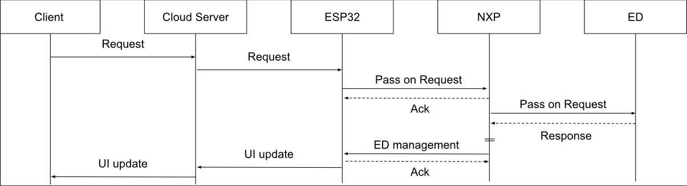
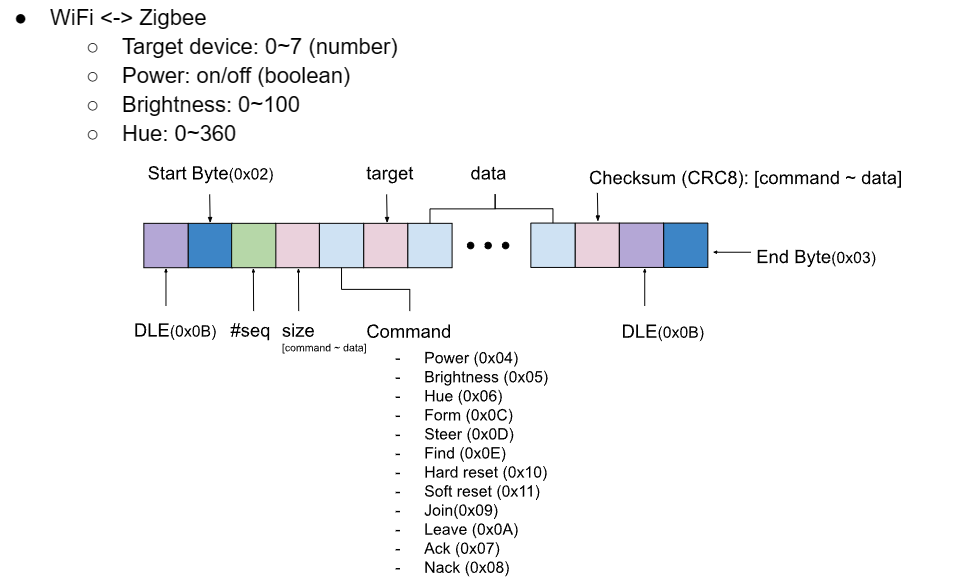
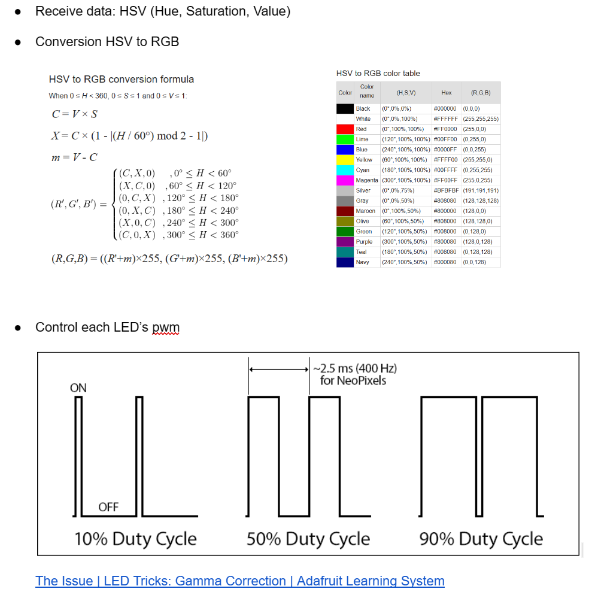

# Intern-2023-nxp

> *Merlotlab Embedded Internship Project*  
> Development Period: 2023.06.26 ~ 2023.08.18

 

### Required Devices

- [ESP32-C3-DevKitM-1](https://docs.espressif.com/projects/esp-idf/en/latest/esp32c3/hw-reference/esp32c3/user-guide-devkitm-1.html#esp32-c3-devkitm-1)
- [NXP-jn5189](https://www.nxp.com/products/wireless/thread/jn5189-88-t-high-performance-and-ultra-low-power-mcus-for-zigbee-and-thread-with-built-in-nfc-option:JN5189_88_T)

 

### Overview

The ultimate goal to achieve is as follows: Enabling users to remotely control IoT LEDs using their smartphones. To achieve this, three major components are required. Firstly, a cloud server is needed that can exchange data remotely between the user's smartphone and the IoT hub. Secondly, a hub is required that can connect to the cloud server, receive control messages input by the user, and forward data to each LED (end device). Lastly, an end device is necessary that will process control commands as received.

 

### Requirement

- Cloud Server
  - Utilizes the AWS Cloud server provided by [ESP Rain Maker](https://rainmaker.espressif.com/) to support communication between the user's phone and ESP.
- Hub-WiFi (ESP32)
  - Connects to the Cloud server through ESP Rain maker.
  - Receives lighting-related control messages.
  - Transmits control messages to NXP-module via USART.
- Hub-Zigbee (JN5189)
  - Exchanges messages with Hub-WiFi through USART.
  - Controls LEDs and connected devices based on control messages (controls RGB light color based on values)

 

### Policy

- #### Hub (Wifi <-> Zigbee message)

  

- #### NXP Light Control

  

 

### Project

- #### jn5189dk_zigbee_coordinator_bm

  Zigbee 3.0 coordinator.   
  Connected to the Hub's wifi-module (esp32), via USART. Responsible for controlling the RGB LED based on received data and pass the on/off controls to end-device LEDs.

  > Two core functions related to the ***policy*** are included in **jn5189dk_zigbee_coordinator_bm**:
  >
  > - **jn5189dk6_rgb_led**: Controls the RGB LED using PWM.
  > - **jn5189dk6_usart_esp_nxp_protocol**: Exchanges data with the esp32 module through USART communication.

- #### jn5189dk_zigbee_router_bm

  Zigbee 3.0 router.  
  Takes the data received from the Coordinator and forwards it to other end-devices or acts as an end-device.

